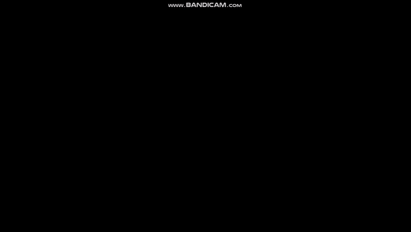

# AI Lunar Landing Game

## Overview

Welcome to the AI Lunar Landing Game project! This project showcases an artificial intelligence system that learns to land a spacecraft on the lunar surface in a simulated game environment. The AI utilizes neural networks and reinforcement learning techniques to master the challenging task of safe lunar landings.

## Model 
Uses Multilayer Precepton trained over large winning exampels that were collected.

## Files and Directory Hierarchy

- **Lunar Landing Game.pptx:** PowerPoint presentation providing an overview of the AI Lunar Landing Game.

- **NeuralNetHolder.py:** Python script containing code related to neural network holder for the trained model.

- **Neural_NetworkFinalIBPNY.ipynb:** Jupyter Notebook with the final implementation of the neural network used in the project.

- **README.md:** This file, providing information about the project, its files, and how to get started.

- **ce889_dataCollection.csv:** CSV file containing data collected during the training process for neural network training.

- **neural_networkfinalPython.py:** Python script containing the final implementation of the neural network used in the project.

## Getting Started

To explore the AI Lunar Landing Game project, follow these steps:

1. Review the PowerPoint presentation for an overview of the project: `Lunar Landing Game.pptx`

2. Examine the code and neural network implementation in the provided Python scripts and Jupyter Notebook.

3. View the recorded lunar landing simulations in the `lunar.gif` and `lunar_game.mp4` files.

## Contributions and Acknowledgments

Contributions to improve and extend the project are welcome. Feel free to open issues, submit pull requests, or suggest enhancements.

Special thanks to the contributors and the open-source community for their valuable contributions and support.

## License

This project is licensed under the MIT License - see the [LICENSE](LICENSE) file for details.

Enjoy exploring the Lunar Landing Game! 🚀🌕

